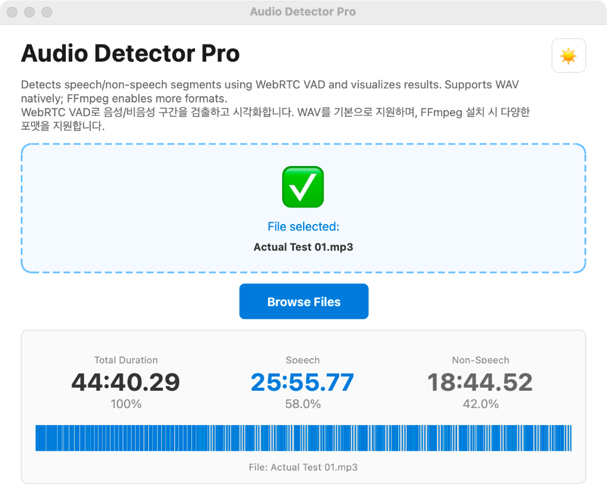

# Audio Detector Pro 🎵

**Audio Detector Pro** is a desktop application that analyzes audio files to detect speech and non-speech segments using WebRTC VAD. It visualizes the results on an interactive timeline and supports various audio formats (WAV, MP3, FLAC, OGG, M4A) via FFmpeg.

**Audio Detector Pro**는 WebRTC VAD를 사용하여 오디오 파일의 음성/비음성 구간을 분석하고 시각화하는 데스크탑 애플리케이션입니다. 직관적인 타임라인 UI를 제공하며 FFmpeg를 통해 다양한 오디오 포맷을 지원합니다.



## Features ✨

- **Speech Detection (VAD)**: Accurate speech/silence segmentation using WebRTC VAD.
- **Timeline Visualization**: Interactive visualization of speech segments. (Speech: Blue, Silence: Grey)
- **Multi-format Support**: Native WAV support + MP3, FLAC, OGG, M4A support (requires FFmpeg).
- **Auto FFmpeg Setup**: Automatically detects or downloads FFmpeg/ffprobe if missing.
- **Drag & Drop**: Simply drag audio files into the window to analyze.
- **Dual Theme**: Dark mode 🌙 and Light mode ☀️ support.
- **Real-time Progress**: Visual progress bar for audio conversion and analysis status.

## Requirements 🛠️

- Python 3.10+
- PyQt6
- webrtcvad
- pydub
- requests

## Installation 📥

1. **Clone the repository**
   ```bash
   git clone https://github.com/your-username/AudioDetectorPro.git
   cd AudioDetectorPro
   ```

2. **Create a virtual environment**
   ```bash
   # macOS / Linux
   python3 -m venv venv
   source venv/bin/activate

   # Windows
   python -m venv venv
   .\venv\Scripts\activate
   ```

3. **Install dependencies**
   ```bash
   pip install -r requirements.txt
   ```

## Usage 🚀

1. **Run the application**
   ```bash
   ./venv/bin/python main.py
   # or
   python main.py
   ```

2. **Analyze Audio**
   - **Drag & Drop** an audio file onto the window.
   - Or click **Browse Files** to select a file.
   - The analysis will start automatically.

3. **View Results**
   - Check **Total Duration**, **Speech Duration**, and **Non-Speech Duration**.
   - Hover over the **Timeline** to see precise timestamps and segment types.
   - Toggle **Dark Mode** with the button in the top-right corner.

## Contributing 🤝

Contributions are welcome! Please fork the repository and submit a Pull Request.

## License 📄

This project is licensed under the MIT License - see the [LICENSE](LICENSE) file for details.
